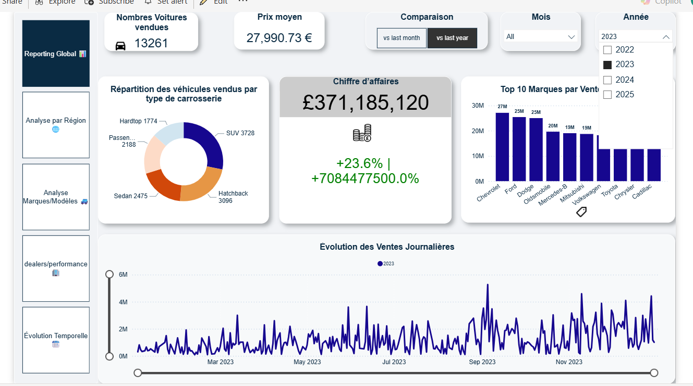
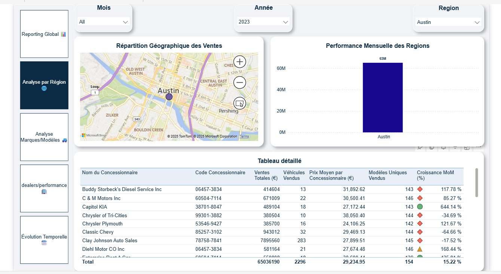
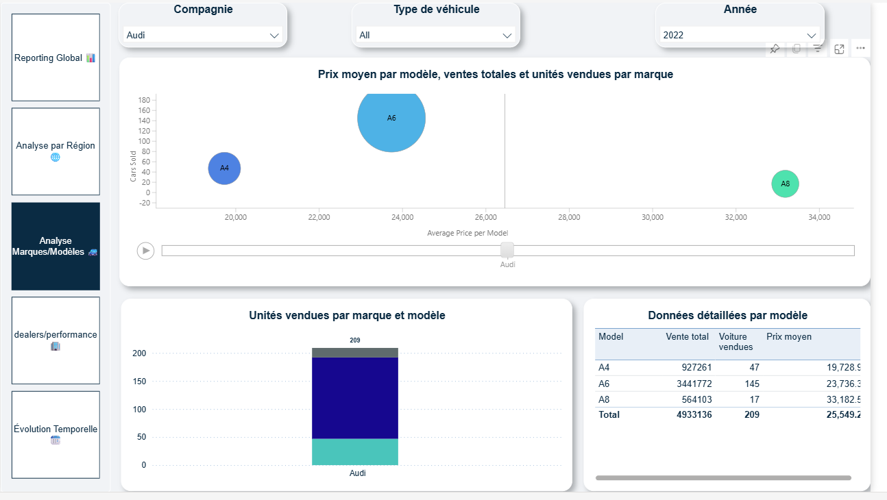
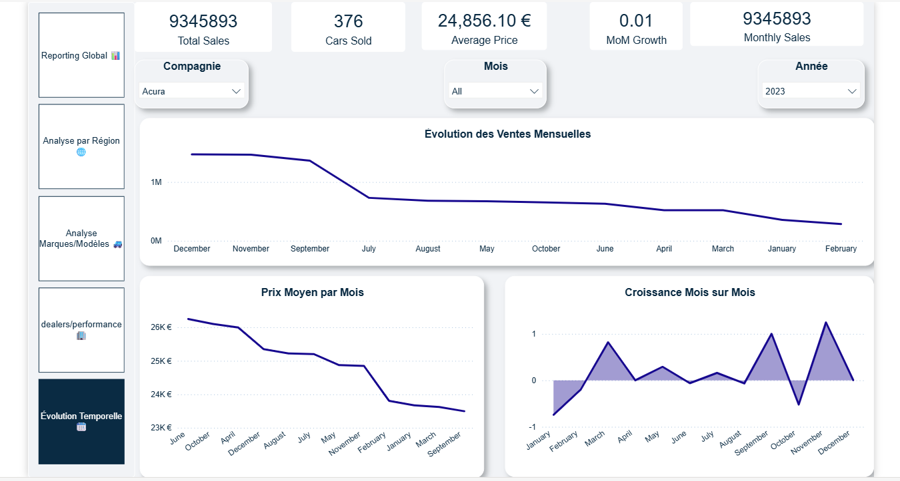

# 📊 Tableau de Bord - Ventes de Voitures

Ce rapport Power BI permet à une direction ou un comité exécutif de suivre et d’analyser les performances commerciales du secteur automobile (véhicules vendus, modèles, régions, concessionnaires, etc.).

---

## 📝 Objectifs / Besoins

- Suivre l'évolution des **ventes totales** et du **prix moyen**.
- Comparer les performances **par région**, **marque** et **modèle**.
- Identifier les **meilleurs concessionnaires**.
- Analyser les **tendances mensuelles** (MoM).
- Offrir une **vue synthétique globale**.
- Faciliter l’ajout de la **sécurité RLS (Row Level Security)** selon la structure de l’entreprise.

---

## 📁 Contenu

- `ventes voitures.pbix` : Fichier Power BI du rapport.
- `Car Sales.xlsx` : Source de données.
- Images : Un screenshot par page du rapport pour illustration.

---

## 📌 Page 1 – Reporting Global

Vue d’ensemble avec chiffres clés, répartition par type de véhicule, top marques, comparaison MoM/YoY et évolution journalière.

---

## 📌 Page 2 – Analyse par Région

Analyse géographique des ventes avec carte, performances régionales et tableau détaillé des concessionnaires.

---

## 📌 Page 3 – Analyse Marques/Modèles

Analyse des modèles, unités vendues, prix moyen par modèle. Visuels : bulles, histogrammes et tableau dynamique.

---

## 📌 Page 4 – Performance par Concessionnaire

Suivi de la performance de chaque dealer, avec évolution des ventes dans le temps et top 10 concessionnaires.

---

## 📌 Page 5 – Évolution Temporelle

Analyse mensuelle de l’évolution des ventes, du prix moyen et de la croissance MoM.

---

## 🔒 Sécurité – RLS (Row Level Security)

Le rapport peut être **adapté avec des rôles personnalisés** selon la structure hiérarchique de l'entreprise (ex. : vue par région, par chef de zone, etc.).  
La sécurité RLS permet de restreindre l'accès aux données en fonction du profil de l'utilisateur connecté.

---

## 🛠 Technologies

- Power BI Desktop
- DAX (formules de mesures avancées)
- Segoe UI (police utilisée pour un rendu professionnel)
- Design épuré et intuitif

---

## 📌 À adapter selon vos besoins

- Ce rapport est un **modèle**.
- L’ajout de **RLS**, de **pages supplémentaires** ou de **connexions directes à un entrepôt de données** peut être intégré selon la réalité de l'entreprise.
