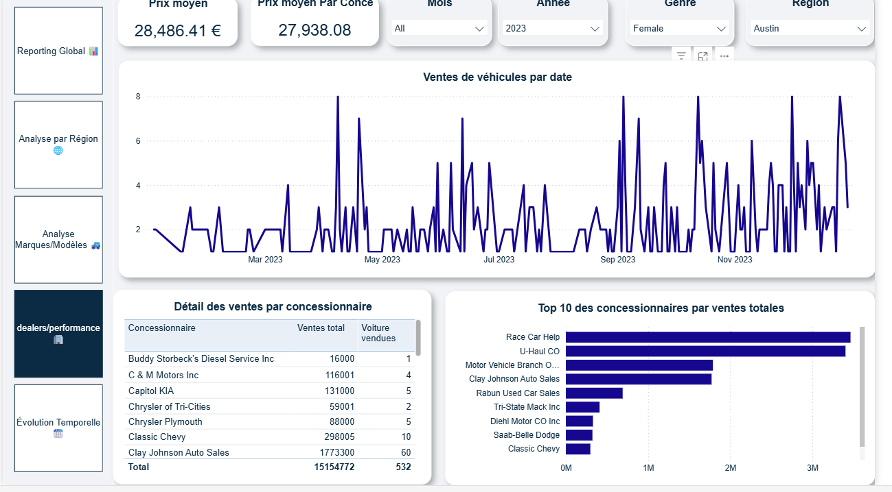

# 📊 Power BI Dashboard – Car Sales Performance
   ## 🧠 Created by Afi TENUDA-EKLOU 
   Mail: afitenuda@gmail.com
   linkden:https://www.linkedin.com/in/afi-tenuda-eklou-832101219/
This Power BI report provides a strategic and executive view of **car sales performance**, helping management monitor key indicators across vehicles, models, regions, and dealerships.

---

## 📝 Goals / Business Needs

- Monitor the evolution of **total sales** and **average price**.
- Compare performance by **region**, **brand**, and **model**.
- Identify **top-performing dealerships**.
- Analyze **monthly trends** (MoM).
- Offer a **comprehensive and visual executive summary**.
- Enable secure access via **Row Level Security (RLS)** based on company structure.

---

## 📁 Contents

- `ventes voitures.pbix` – Power BI report file  
- `Car Sales.xlsx` – Main data source  
- `./images/` – One screenshot per report page for documentation  

---

## 📌 Page 1 – Global Overview

High-level KPIs, vehicle type breakdown, top brands, MoM/YoY comparison, and daily trends.

---

## 📌 Page 2 – Regional Analysis

Interactive map with heat zones and regional bar charts. Includes detailed dealer table.

---

## 📌 Page 3 – Brand/Model Analysis

Model-level analysis: units sold, average price, and performance. Includes scatter plot, bar chart, and dynamic table.

---

## 📌 Page 4 – Dealership Performance

Track individual dealership performance, sales trends, and top 10 rankings.

---

## 📌 Page 5 – Time-Based Analysis

Monthly evolution of sales and average price, including MoM growth with trend line.

---

### 🎯 Target Audience

This Power BI dashboard is primarily designed for the company’s **executive and management teams**, including:

- **General Management** – for a global overview of sales performance  
- **Sales Management** – to track performance by brand, model, region, and dealership  
- **Regional Managers** – to monitor performance within their assigned territory  
- **Business Analysts** – to analyze monthly and yearly growth trends  

> 🛡️ This report can be adapted into user-specific views through **Role-Based Security (RLS)**.

---

## 🔐 Row-Level Security (RLS)

The data model is structured to support **dynamic user filtering**, including:

- By **Dealership**
- By **Region**
- By **User Role** (executive, manager, analyst)

> ℹ️ Custom roles can be implemented using `USERPRINCIPALNAME()` to filter the data for each logged-in user.

---

## 🛠 Data & Sources

- `ventes voitures.pbix` – Main Power BI report  
- `Car Sales.xlsx` – Clean Excel data source  
- Visual assets (PNG) – For documentation and preview  

---

## 📦 Future Enhancements

- Add dynamic filtering by **customer type** (individual vs corporate)
- Implement RLS based on **hierarchical roles**
- Integrate **predictive trends** (forecast for upcoming 6 months)

---

## 🧠 Created by Afi TENUDA-EKLOU

This Power BI dashboard was developed for **portfolio purposes**, and can be easily **adapted for enterprise use** across any car sales company or dealership network.
